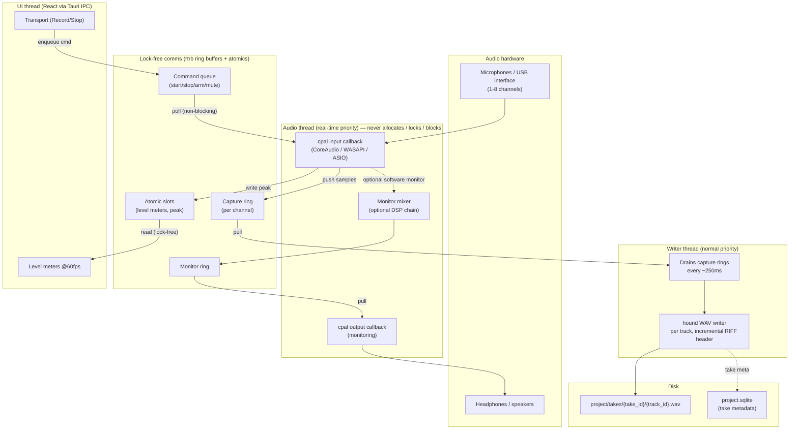

# Architecture — SundayStudio

This document is about the part of SundayStudio that is genuinely hard: the
**real-time audio engine**. Everything else (UI, project files, export) is
ordinary application work. The engine is not, and the whole product depends on
it being correct.

## Why a dedicated real-time thread

A 90-minute recording must never be lost to a glitch or a crash. That single
requirement dictates the whole shape:

- The OS hands us audio on a **callback with a hard deadline**. Miss it and you
  get a click, a dropout, or a stall. So the callback must do the absolute
  minimum and must be free of anything that can block: no allocation, no locks,
  no syscalls, no disk.
- Disk writes, UI updates, and command handling are all things that _can_
  block. They therefore live on **other threads**, and communicate with the
  audio thread only through **lock-free** structures.

## Threads and queues



### Recording sequence (Phase 1.2)

```mermaid
sequenceDiagram
    participant UI as UI (React)
    participant CMD as Command queue
    participant AUD as Audio thread (cpal)
    participant RING as Capture rings
    participant WR as Writer thread
    participant FS as Disk (WAV + SQLite)

    UI->>CMD: enqueue Start{armed tracks}
    AUD->>CMD: poll (non-blocking) → Start
    Note over AUD: arm channels, mark t0
    loop every cpal callback (e.g. 256 frames)
        AUD->>RING: push input frames (per channel)
        AUD->>UI: write peak to atomic slot
    end
    loop every ~250ms
        WR->>RING: drain available frames
        WR->>FS: append to per-track WAV, update header len
    end
    UI->>CMD: enqueue Stop
    AUD->>CMD: poll → Stop
    Note over AUD: stop arming; flush
    WR->>FS: finalize WAV headers
    WR->>FS: write take metadata (SQLite)
```

## Phase 0.1 — what exists today

The foundation is proven before the engine is built. Phase 0.1 ships only:

- `audio::devices::enumerate()` — lists input/output devices and their
  capabilities via cpal. Proves the OS audio layer links and answers on both
  CoreAudio and WASAPI.
- `audio::tone::write_test_tone()` — synthesises a 1-second sine and writes a
  canonical WAV via hound. Proves the recording-to-file path round-trips.

Neither runs on a real-time thread yet — they are synchronous smoke tests. The
threading model above is built in **Phase 1** (1.1 device selection + hot-plug,
1.2 the recorder, 1.3 low-latency monitoring), which is where the schedule
deliberately spends the most time.

## Data flow invariants (must always hold)

1. The audio callback's worst-case execution time is bounded and contains no
   unbounded operation (allocation, lock, syscall, disk).
2. No more than ~1 second of audio is ever held in memory before reaching disk.
3. WAV headers are updated incrementally so an abrupt termination leaves a
   playable file; files > 4 GB use the 64-bit RIFF (wav64) extension.
4. A sample-rate mismatch between interface and project is surfaced explicitly —
   never silently resampled during capture.

## Module map (`src-tauri/src`)

| Module     | Phase | Responsibility                                           |
| ---------- | ----- | -------------------------------------------------------- |
| `audio`    | 0.1/1 | device enumeration (0.1); recorder/mixer/monitor (1)     |
| `dsp`      | 4     | bundled effects: gate, EQ, de-esser, compressor, limiter |
| `project`  | 2.1   | `.scast` format + SQLite (tape model: takes → regions)   |
| `export`   | 7     | ffmpeg encode, LUFS targets, ID3, chapters, RSS          |
| `ai`       | 5/6   | Anthropic + Suno wrappers (never on the audio thread)    |
| `commands` | all   | thin Tauri IPC handlers (`entity_verb`)                  |
| `services` | —     | cross-cutting (db pool, account, AI quota)               |
